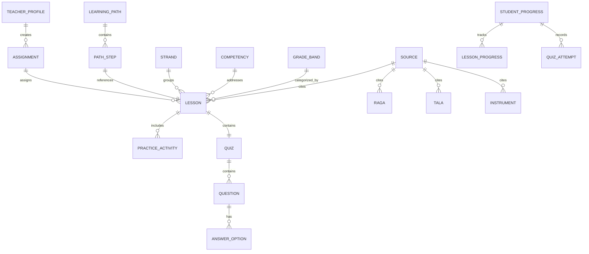

# අන්තර්ගත දත්ත ආකෘතිය (CONTENT_MODEL.md)
## “ස්වර මඟ” පෙරදිග සංගීතය ඉගෙනුම් වේදිකාව

මෙම ලේඛනය “ස්වර මඟ” වේදිකාවේ අන්තර්ගත සියලුම දත්ත ව්‍යුහයන් (Entities), ඒවා අතර සබඳතා (Relationships), සහ අන්තර්ගත වලංගුතා නීති (Validation Rules) විස්තර කරයි.

---

## 1. ප්‍රධාන දත්ත වස්තු (Core Entities)



---

## 2. ආයතනික ආකෘති (Entity Schemas)

### 2.1 Lesson (පාඩම)
```typescript
interface Lesson {
  id: string; // e.g. "les-swara-01"
  strandId: string; // e.g. "strand-swara-shruti"
  title_si: string; // "මූලික සප්ත ස්වර හැඳින්වීම"
  title_en?: string; // "Introduction to Seven Basic Swaras"
  slug: string;
  summary_si: string;
  learningGoal_si: string; // "මෙම පාඩම අවසානයේ ඔබට..."
  estimatedMinutes: number;
  gradeBands: GradeBandType[]; // ["6-7", "8-9", "10-11"]
  difficulty: "පහසු" | "මධ්‍යම" | "උසස්";
  prerequisites: string[]; // lesson IDs or concept codes
  diagnosticQuestion: DiagnosticQuestion;
  contentSections: LessonSection[]; // short explanation, key terms, diagrams
  listenActivity: AudioActivity; // "සවන් දෙමු"
  performActivity?: PerformActivity; // "ගයමු" / "වාදනය කරමු"
  guidedPractice: PracticeTask;
  independentPractice: PracticeTask;
  quizId: string;
  recap_si: string[];
  sourceReference: SourceReference;
  reviewMetadata: ReviewMetadata;
  nextRecommendedLessonId?: string;
  published: boolean;
}
```

### 2.2 Raga (රාගය)
```typescript
interface Raga {
  id: string; // "raga-bhairav"
  name_si: string; // "භෛරව් රාගය"
  name_en: string; // "Raga Bhairav"
  thata_si: string; // "භෛරව් ථාටය"
  arohana_si: string; // "ස , රි(කො) , ග , ම , ප , ධ(කො) , නි , ස උච්ච"
  avarohana_si: string; // "ස උච්ච , නි , ධ(කො) , ප , ම , ග , රි(කො) , ස"
  arohana_swaras: string[]; // ["S", "r", "G", "M", "P", "d", "N", "S'"]
  avarohana_swaras: string[]; // ["S'", "N", "d", "P", "M", "G", "r", "S"]
  vadi_si: string; // "ධෛවත (ධ)"
  samvadi_si: string; // "රිෂභ (රි)"
  jati_si: string; // "සම්පූර්ණ - සම්පූර්ණ"
  time_si: string; // "ප්‍රාතඃ කාලය (උදෑසන පළමු ප්‍රහාරය)"
  rasa_si: string; // "ශාන්ත, භක්ති"
  pakad_si: string; // "ග ම ධ - ප, ග ම රි - ස"
  characteristics_si: string[];
  gradeBands: GradeBandType[];
  sourceReference: SourceReference;
  reviewMetadata: ReviewMetadata;
}
```

### 2.3 Tala (තාලය)
```typescript
interface Tala {
  id: string; // "tala-teental"
  name_si: string; // "ත්‍රීතාලය (තීන්තාල්)"
  matras: number; // 16
  vibhags: number[]; // [4, 4, 4, 4]
  taliKhali: string[]; // ["තාළි (1)", "තාළි (5)", "ඛාලි (9)", "තාළි (13)"]
  theka_si: string; // "ධා ධින් ධින් ධා | ධා ධින් ධින් ධා | ධා තින් තින් තා | තා ධින් ධින් ධා"
  bols: TalaBol[];
  gradeBands: GradeBandType[];
  sourceReference: SourceReference;
  reviewMetadata: ReviewMetadata;
}
```

### 2.4 Review & Rights Metadata (සමාලෝචන හා හිමිකම් පාරදත්ත)
```typescript
interface ReviewMetadata {
  status:
    | "Draft"
    | "Source Checked"
    | "Sinhala Reviewed"
    | "Music Reviewed"
    | "Rights Checked"
    | "Published"
    | "Needs Revision"
    | "Archived";
  reviewer: string;
  reviewDate: string;
  lastVerifiedDate: string;
  changeNotes: string;
  license: string;
  reuseStatus: "Verified Original" | "Curriculum Canonical" | "Public Domain" | "Synthetic Web Audio";
}
```

---

## 3. ප්‍රකාශන වලංගුතා නීති (Publishing Validation Rules)

පද්ධතිය තුළ යම් අන්තර්ගතයක් `Published` තත්ත්වයට පත් කිරීමට පහත සියලු කොන්දේසි සපුරාලිය යුතුය:
1. `title_si` සහ `learningGoal_si` හිස් නොවිය යුතුය (සිංහල යුනිකෝඩ් විය යුතුය).
2. `sourceReference.sourceId` නිල මූලාශ්‍ර නාමාවලියෙහි (`data/sources.json`) පැවතිය යුතුය.
3. `sourceReference.pageOrSection` නිවැරදිව සඳහන් කර තිබිය යුතුය.
4. `reviewMetadata.status` යන්න `Published` විය යුතු අතර `reviewer`, `reviewDate`, `license` අනිවාර්යයෙන් පිරවිය යුතුය.
5. කිසිදු ප්‍රකාශන හිමිකම් කඩවීමක් නොමැති බවට `reuseStatus` තහවුරු කර තිබිය යුතුය.
