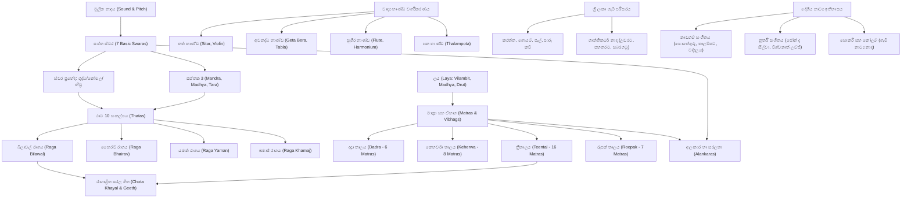

# විෂය නිර්දේශ සිතියම්කරණය (CURRICULUM_MAP.md)
## “ස්වර මඟ” - ශ්‍රී ලංකා පාසල් පෙරදිග සංගීතය විෂය මාලා පෙළගැස්ම

මෙම ලේඛනය ජාතික අධ්‍යාපන ආයතනයේ (NIE) 6 සිට 13 ශ්‍රේණි දක්වා පෙරදිග සංගීතය විෂය නිර්දේශ නිපුණතා, “ස්වර මඟ” ඉගෙනුම් වේදිකාවේ ප්‍රධාන ධාරා (Strands), අදාළ පාඩම්, සංකල්පීය පූර්වාවශ්‍යතා සහ ඇගයීම් ක්‍රමවේද අතර පවතින සබඳතාව සිතියම්ගත කරයි.

---

## 1. විෂය ධාරා සහ නිපුණතා පෙළගැස්ම (Strands & Competency Matrix)

| ධාරාව (Strand) | විෂය ක්ෂේත්‍රය | අදාළ ශ්‍රේණි | NIE නිපුණතා ආශ්‍රය | පාදක පාඩම් සහ ඒකක |
| :--- | :--- | :--- | :--- | :--- |
| **ධාරාව A** | මූලික සංගීත දැනුම (Music Fundamentals) | 6–9, 10–11 | නිපුණතාව 1.0 (නාදය හා ස්වර විමර්ශනය) | `les-intro-01` (නාදය හා සංගීත නාදය), `les-swara-01` (සප්ත ස්වර), `les-saptaka-01` (සප්තක 3) |
| **ධාරාව B** | ලය හා තාල (Laya & Tala) | 6–13 | නිපුණතාව 2.0 (තාලානුකූල රිද්ම භාවිතය) | `les-tala-dadra` (දාද්‍රා තාලය), `les-tala-keherwa` (කෙහර්වා තාලය), `les-tala-teental` (ත්‍රීතාලය), `les-tala-roopak` (රූපක් තාලය) |
| **ධාරාව C** | රාග අධ්‍යයනය (Raga Studies) | 8–13 | නිපුණතාව 3.0 (රාග ශාස්ත්‍රය හා ගායනය) | `les-raga-bilawal` (බිලාවල්), `les-raga-bhairav` (භෛරව්), `les-raga-yaman` (යමන්/කල්‍යාන්), `les-raga-khamaj` (ඛමාජ්) |
| **ධාරාව D** | ගායන හා වාදන පුහුණුව (Vocal & Instrumental) | 6–13 | නිපුණතාව 4.0 (ප්‍රායෝගික ගායන වාදන කුසලතා) | `les-vocal-posture` (හඬ පුහුණුව හා ආසන), `les-alankara-01` (අලංකාර හා සරලතා) |
| **ධාරාව E** | වාද්‍ය භාණ්ඩ (Musical Instruments) | 6–13 | නිපුණතාව 5.0 (භාණ්ඩ වර්ගීකරණය හා නාද නිෂ්පාදනය) | `les-inst-overview` (චතුර්විධ වාද්‍ය භාණ්ඩ), `les-inst-sitar-tabla` (සිතාරය හා තබ්ලාව), `les-inst-desi-drums` (දේශීය බෙර) |
| **ධාරාව F** | ශ්‍රී ලාංකීය ජන හා දේශීය සංගීතය (Folk Music) | 6–13 | නිපුණතාව 6.0 (දේශීය නාද රටා හා ජන ගී) | `les-folk-work` (ගොයම්, නෙළුම්, කරත්ත, පාරු කවි), `les-folk-raban` (රබන් පද හා ගැමි නාද), `les-folk-shanthi` (ශාන්තිකර්ම) |
| **ධාරාව G** | නාට්‍ය හා රංග සංගීතය (Theatre & Dramatic) | 9–13 | නිපුණතාව 7.0 (දේශීය නාට්‍ය සංගීත සම්ප්‍රදාය) | `les-theatre-nadagam` (නාඩගම් සංගීතය), `les-theatre-nurthi` (නූර්ති ගීත), `les-theatre-folkdrama` (සොකරි හා කෝලම්) |
| **ධාරාව H** | ගී රසවිඳීම හා ඉතිහාසය (Appreciation) | 10–13 | නිපුණතාව 8.0 (සංගීත විචාරය හා රසවින්දනය) | `les-apprec-elements` (ගීතයක සංගීතමය අංග විමර්ශනය), `les-history-pioneers` (ශ්‍රී ලාංකීය සංගීත ප්‍රබෝධය) |
| **ධාරාව I** | නිර්මාණ හා සංගීත තාක්ෂණය (Creativity & Tech) | 10–13 | නිපුණතාව 9.0 (තනු නිර්මාණය හා ඩිජිටල් මෙවලම්) | `les-creative-swara` (ස්වර රටා නිර්මාණය), `les-creative-rhythm` (රිද්ම රටා සකස් කිරීම) |
| **ධාරාව J** | විභාග පුහුණුව (Examination Practice) | 10–13 | නිපුණතාව 10.0 (විභාග ගැටලු විසඳීම) | `exam-ol-model-01` (සා.පෙළ මාදිලි ප්‍රශ්න පත්‍රය), `exam-al-model-01` (උ.පෙළ මාදිලි ප්‍රශ්න පත්‍රය) |

---

## 2. සංකල්පීය පූර්වාවශ්‍යතා සිතියම (Prerequisite Graph)

---

## 3. ශ්‍රේණි මට්ටම් සහ ඇගයීම් පෙළගැස්ම (Grade Bands & Assessment)

- **6–7 ශ්‍රේණි (ආරම්භක)**: මූලික ශ්‍රව්‍ය හඳුනාගැනීම, ස්වර 7, සරල තාල (දාද්‍රා, කෙහර්වා), ගැමි කවි තාලයට ගැයීම.
- **8–9 ශ්‍රේණි (මූලික මධ්‍යම)**: ස්වර ප්‍රභේද 12, සප්තක, භූපාලි හා කාෆි රාග, ත්‍රීතාලය, චතුර්විධ වාද්‍ය භාණ්ඩ, නාඩගම් ගීත.
- **10–11 ශ්‍රේණි (සාමාන්‍ය පෙළ)**: ථාට 10, රාග 4 (භෛරව්, යමන්, බිලාවල්, ඛමාජ්), රූපක් හා ජප්තාල, දේශීය බෙර වර්ග හා වාදන විධි, නූර්ති/සොකරි/කෝලම්, සා.පෙළ ව්‍යුහගත ප්‍රශ්න.
- **12–13 ශ්‍රේණි (උසස් පෙළ)**: ශ්‍රැති 22 නාද න්‍යාය, රාග සංසන්දනය (භෛරවී, ජයජයවන්තී, බාගේශ්‍රී), උසස් තාල ශාස්ත්‍රය, සංගීත ඓතිහාසික විකාශනය, උ.පෙළ විචාරාත්මක ප්‍රශ්න.
