# විෂය නිර්දේශ සිතියම්කරණය (CURRICULUM_MAP.md)
## “ස්වර මඟ” — ශ්‍රී ලංකා පාසල් පෙරදිග සංගීතය නිපුණතා න්‍යාසය (Grades 6–11)

මෙම ලේඛනය ජාතික අධ්‍යාපන ආයතනයේ (NIE), අධ්‍යාපන ප්‍රකාශන දෙපාර්තමේන්තුවේ සහ විභාග දෙපාර්තමේන්තුවේ නිල මූලාශ්‍ර ලේඛන 30 පදනම් කරගනිමින්, “ස්වර මඟ” ඉගෙනුම් වේදිකාවේ නිපුණතා න්‍යාසය, සංකල්පීය පූර්වාවශ්‍යතා සහ ඇගයීම් ක්‍රමවේදය සිතියම්ගත කරයි.

---

## 1. නිල නිපුණතා සහ විෂය ධාරා පෙළගැස්ම (Competency Framework)

| නිපුණතාව | නිල නිපුණතා ප්‍රකාශය (NIE Official Statement) | අදාළ ශ්‍රේණි | මූලාශ්‍ර ලේඛන හා පිටු | සංකල්පීය මාවත (Path) |
|---|---|:---:|---|---|
| **1.0** | **සංගීතයේ මූලිකාංග, ශිල්පාංග සහ සිද්ධාන්ත හඳුනා ගනිමින් ගායන/වාදන ප්‍රායෝගික හැකියා ප්‍රදර්ශනය කරයි.** | 6, 7, 8, 9, 10, 11 | `grade_6_music_teacher_guide.md` (p.10–50), `grade_8_music_teacher_guide.md` (p.35–60), `grade_11_music_textbook.md` (p.1–60) | **Path 1**: හඬ හා නාදය **Path 2**: ස්වර මඟ **Path 3**: ලයයෙන් තාලයට **Path 4**: ස්වරයෙන් රාගයට |
| **2.0** | **වාද්‍ය භාණ්ඩයන්හි ස්වරූපය වටහා ගනිමින් වාදන හැකියා ප්‍රදර්ශනය කරයි.** | 6, 7, 8, 9, 10, 11 | `sg9_emus_music_instruments.pdf` (p.1–5), `sg7_emus_chap2.1.2_violin.pdf` (p.1–12), `tabla.md` (p.1–23) | **Path 5**: ගයමු • වයමු **Path 6**: අපේ සංගීත උරුමය |
| **3.0** | **සංගීත රසාස්වාදයේ යෙදෙමින් ජීවිතයේ සතුට හා බැඳි මානසික තත්ත්වයන් ළඟා කර ගැනීමට හුරු වෙයි.** | 6, 7, 8, 9, 10, 11 | `grade_8_music_teacher_guide.md` (p.55–68), `grade_11_music_textbook.md` (p.65–75) | **Path 7**: රංගය, ගීතය හා රසවිඳීම |
| **4.0** | **දේශීය ජන සංගීතාංග පිළිබඳ ප්‍රායෝගික හැකියාව වර්ධනය කර ගනිමින් සංස්කෘතික උරුමයන් රැක ගනියි.** | 6, 7, 8, 9, 10, 11 | `rg_sg10_emus_u4_ජන ගී වර්ගීකරණය_p1.pdf` (p.1–5), `grade_6_music_teacher_guide.md` (p.51–65) | **Path 6**: අපේ සංගීත උරුමය |
| **5.0** | **සරල සංගීතය හා බැඳි සංගීතාංග පිළිබඳ අත්දැකීම් ලබයි.** | 7, 8, 9, 10, 11 | `grade_8_music_teacher_guide.md` (p.69–75), `grade_11_music_textbook.md` (p.76–82) | **Path 7**: රංගය, ගීතය හා රසවිඳීම |
| **6.0** | **රංග සම්ප්‍රදායයන්හි විශේෂතා අධ්‍යයනය කරමින් සංගීතමය ලක්ෂණ පිළිබඳ ප්‍රායෝගික අත්දැකීම් ලබයි.** | 8, 9, 10, 11 | `sg9_emus__kolam.pdf` (p.1–5), `grade_8_music_teacher_guide.md` (p.76–88), `grade_10_folk_song_classification.md` | **Path 7**: රංගය, ගීතය හා රසවිඳීම |
| **7.0** | **සංගීත නිර්මාණ කාර්යයයේ අත්හදා බැලීම් කරයි.** | 7, 8, 9, 10, 11 | `grade_8_music_teacher_guide.md` (p.89–98), `grade_11_music_textbook.md` (p.83–88) | **Path 8**: සංගීතය ලියමු • නිර්මාණය කරමු |
| **8.0** | **සංකේතානුසාරයෙන් සංගීතය ලියා දක්වන විධි හඳුනා ගනිමින් විශ්ව සංගීත කෘති ඇසුරු කිරීමටත් දේශීය සංගීතාංග වෙත යොමු කිරීමටත් අත්‍යවශ්‍ය මූලික නිපුණතා වර්ධනය කරගනියි.** | 6, 7, 8, 9, 10, 11 | `grade_10_western_music.md` (p.1–40), `grade_11_music_textbook.md` (p.89–92) | **Path 8**: සංගීතය ලියමු • නිර්මාණය කරමු |
| **9.0** | **සංගීතයේ භෞතික විද්‍යාත්මක හා තාක්ෂණික පදනම විමසමින් නවීන මෙවලම් භාවිත කරයි.** | 10, 11 | `sg10_emus_chap8_nadaya.pdf` (p.1–12), `computer_music.md` (p.1–39) | **Path 9**: සංගීත විද්‍යාව හා තාක්ෂණය |

> [!NOTE]
> **12–13 ශ්‍රේණි (උසස් පෙළ) සීමාව**:
> වර්තමාන නිල මූලාශ්‍ර එකතුව (ලේඛන 30) 6 සිට 11 ශ්‍රේණි දක්වා විෂය පථය සම්පූර්ණයෙන් ආවරණය කරයි. උසස් පෙළට අදාළ අතිරේක විෂය කරුණු “අතිරේක පරිශීලනය (Supplementary)” ලෙස ලේබල් කර ඇති අතර නිල මූලාශ්‍ර ගොනු ඇතුළත් වන තුරු ප්‍රකාශිත මූලික විෂය පථය 6–11 ශ්‍රේණි මත ස්ථිරව පිහිටුවා ඇත.

---

## 2. සංකල්පීය පූර්වාවශ්‍යතා සිතියම (Prerequisite Graph)

```mermaid
graph TD
    A1["මූලික නාදය හා ශබ්දය (Sound & Pitch)"] --> A2["සප්ත ස්වර (7 Basic Swaras)"]
    A2 --> A3["විකෘති ස්වර (කෝමල 4 සහ තීව්‍ර ම)"]
    A2 --> A4["සප්තක 3 (මන්ද්‍ර, මධ්‍ය, තාර)"]
    A3 & A4 --> C1["ථාට 10 සංකල්පය (Thatas)"]
    
    C1 --> C2["බිලාවල් රාගය (Bilawal - G8)"]
    C1 --> C3["භූපාලි රාගය (Bhupali - G8)"]
    C1 --> C4["කාෆි රාගය (Kafi - G9)"]
    C1 --> C5["ඛමාජ් රාගය (Khamaj - G9)"]
    C1 --> C6["භිම්පලාසි රාගය (Bhimpalasi - G9)"]
    C1 --> C7["භෛරව් රාගය (Bhairav - G10)"]
    C1 --> C8["යමන් රාගය (Yaman - G10)"]
    C1 --> C9["භෛරවී රාගය (Bhairavi - G11)"]
    
    B1["ලය (විලම්බිත, මධ්‍ය, දෘත)"] --> B2["මාත්‍රා, විභාග, තාළි, ඛාලි"]
    B2 --> B3["කෙහර්වා තාලය (මාත්‍රා 8)"]
    B2 --> B4["දාද්‍රා තාලය (මාත්‍රා 6)"]
    B2 --> B5["ත්‍රීතාල් තාලය (මාත්‍රා 16)"]
    B2 --> B6["ජප්තාලය (මාත්‍රා 10)"]
    B2 --> B7["දීප්චන්දි තාලය (මාත්‍රා 14)"]
    B2 --> B8["රූපක් තාලය (මාත්‍රා 7)"]
    B2 --> B9["ලාවනී සහ ඛෙම්ටා තාල"]
    
    E1["පංචතූර්ය නාදය"] --> E2["ආතත (අත් රබාන, බුම්මැඩිය)"]
    E1 --> E3["විතත (තම්මැට්ටම)"]
    E1 --> E4["විතතාතත (දවුල, උඩැක්කිය)"]
    E1 --> E5["ඝන (තාලම්පට, පන්තේරුව)"]
    E1 --> E6["සුෂිර (හොරණෑව, බටනලාව)"]
    
    G1["දේශීය රංග සම්ප්‍රදායන්"] --> G2["නාඩගම් (මද්දලය, පසන් තාලය)"]
    G1 --> G3["නූර්ති (ජෝන් ද සිල්වා, හාමෝනියම්)"]
    G1 --> G4["කෝලම් (වෙස් මුහුණු, ජසයා-ලෙන්චිනා)"]
    G1 --> G5["සොකරි (ගැමි නාට්‍ය)"]
```

---

## 3. ශ්‍රේණි මට්ටම් අනුව ප්‍රගතිශීලී අනාවරණය (Spiral Progressive Disclosure)

1. **6 ශ්‍රේණිය (පදනම - හඳුනාගනිමු)**:
   - ශබ්දය vs නාදය, නාදයේ ලක්ෂණ 3, ශුද්ධ සප්ත ස්වර (ස රි ග ම ප ධ නි), සරල අලංකාර 7, කහර්වා සහ දාදරා මූලික අත්පුඩි, ජන ක්‍රීඩා ගීත.
2. **7 ශ්‍රේණිය (විකෘති ස්වර හා වාදනය - තේරුම් ගනිමු)**:
   - කෝමල ස්වර 4, තීව්‍ර මධ්‍යම, සප්තකයේ ස්වර 12, දාද්‍රා/කෙහර්වා ඨේකා තබ්ලා බෝල්, වයලීන වාදන ඉරියව් හා තත් 4 සුසර ක්‍රම.
3. **8 ශ්‍රේණිය (ප්‍රථම රාග හා ත්‍රීතාලය - පුහුණු වෙමු)**:
   - බිලාවල් හා භූපාලි රාග, ත්‍රීතාලය (මාත්‍රා 16), නාඩගම් හා නූර්ති ඉතිහාසය, කෙත හා බැඳි ගැමි ගී (ගොයම්/නෙළුම්/කමත්), සිතාර්/එස්රාජ් හස්ත සාධනය.
4. **9 ශ්‍රේණිය (රාග විවිධත්වය හා පංචතූර්ය - යොදා ගනිමු)**:
   - ඛමාජ්, කාෆි, භිම්පලාසි රාග, පංචතූර්ය භාණ්ඩ 14 වර්ගීකරණය, කෝලම් රංග සම්ප්‍රදාය, තාල සංසන්දනය.
5. **10 ශ්‍රේණිය (ශාස්ත්‍රීය ගැඹුර හා ධ්වනි විද්‍යාව - ප්‍රවීණ වෙමු)**:
   - භෛරව් හා යමන් රාග, ජප්තාලය, දීප්චන්දි, රූපක්, ලාවනී, ඛෙම්ටා තාල, ශ්‍රී ලාංකීය ජන ගී විද්‍යාත්මක වර්ගීකරණය, නාදයේ භෞතික විද්‍යාව (සංඛ්‍යාතය, විස්තාරය, අනුනාදය).
6. **11 ශ්‍රේණිය (සම්පූර්ණ O/L විෂය ප්‍රවීණතාව - විභාග ජයග්‍රහණය)**:
   - නිර්දේශිත රාග 7 පූර්ණ සංසන්දනය, තානාලංකාර, සියලු තාල ප්‍රස්තාරගත කිරීම, පරිගණක සංගීතය සහ MIDI, O/L ව්‍යුහගත හා බහුවරණ ආදර්ශ ප්‍රශ්න පත්‍ර.
