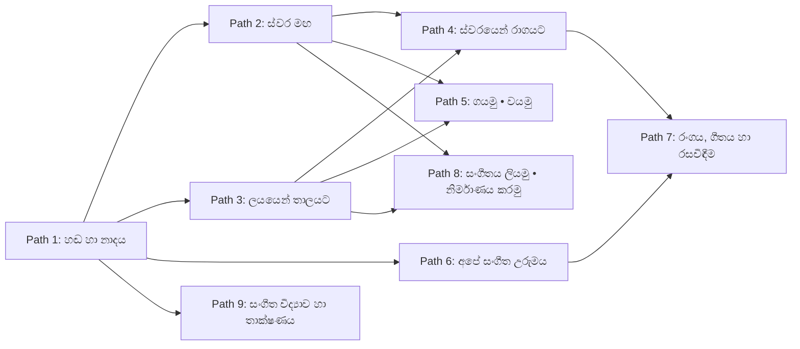

# LEARNING_ARCHITECTURE.md — සංකල්පීය ඉගෙනුම් ව්‍යුහය

**“ස්වර මඟ” (Swara Maga)** වේදිකාවේ ඉගෙනුම් ක්‍රමවේදය පෙළපොතේ හෝ වාරයේ අනුපිළිවෙළට සීමා නොවී, සංගීත සංකල්ප අතර පවතින තාර්කික පූර්වාවශ්‍යතා පදනම් කරගත් **සංකල්පීය කශේරුකාවක් (Concept Spine with Grade Lenses)** ඔස්සේ ගොඩනගා ඇත.

---

## 1. ප්‍රධාන ඉගෙනුම් මාවත් 9 (The 9 Core Learning Paths)

### Path 1 — හඬ හා නාදය (Sound Awareness & Acoustics)
- **මූලික සංකල්ප**: ශබ්දය vs සංගීත නාදය, කම්පන, නාදයේ ලක්ෂණ 3 (තාරතාවය, විපුලතාවය, ධ්වනි ගුණය), ශබ්ද තරංග, සංඛ්‍යාතය (Hz).
- **ප්‍රගතිශීලී අනාවරණය**:
  - *Grade 6*: කනට ඇසෙන ශබ්ද සහ සංගීත නාද වෙන්කර හඳුනාගැනීම.
  - *Grade 10*: කම්පන විද්‍යාව, අනුනාදය, සංඛ්‍යාත ප්‍රස්ථාර.

### Path 2 — ස්වර මඟ (Swaras, Scales & Saptakas)
- **මූලික සංකල්ප**: සප්ත ස්වර (ස රි ග ම ප ධ නි), ශුද්ධ සහ විකෘති ස්වර (කෝමල 4, තීව්‍ර 1), සප්තක 3 (මන්ද්‍ර, මධ්‍ය, තාර), සරල අලංකාර රටා, ස්වර ස්ථාපන ගීත.
- **ප්‍රගතිශීලී අනාවරණය**:
  - *Grade 6*: ශුද්ධ ස්වර 7 සහ මූලික සප්තක හඳුනාගැනීම.
  - *Grade 7*: කෝමල හා තීව්‍ර ස්වර 5 සහ සප්තකයේ ස්වර 12.
  - *Grade 8*: සරල අලංකාර 7 සහ රාගාශ්‍රිත ස්වර ස්ථාපනය.

### Path 3 — ලයයෙන් තාලයට (Rhythm & Tala Systems)
- **මූලික සංකල්ප**: ලය (විලම්බිත, මධ්‍ය, දෘත), මාත්‍රා, විභාග, තාලස්ථාන, සම, තාළි, ඛාලි, ආවර්ත, ඨේකා, තබ්ලා බෝල්.
- **තාල පෙළගැස්ම**:
  - *Grade 6–7*: දාද්‍රා (මාත්‍රා 6), කෙහර්වා (මාත්‍රා 8).
  - *Grade 8*: ත්‍රීතාලය / තීන්තාල් (මාත්‍රා 16).
  - *Grade 9–10*: ජප්තාලය (මාත්‍රා 10), දීප්චන්දි (මාත්‍රා 14), රූපක් (මාත්‍රා 7), ලාවනී, ඛෙම්ටා.

### Path 4 — ස්වරයෙන් රාගයට (Raga Musicology)
- **මූලික සංකල්ප**: ආරෝහණ, අවරෝහණ, වාදී, සංවාදී, ජාතිය (ඕඩව, ෂාඩව, සම්පූර්ණ), ථාටය (මේලය), ගාන සමය, මුඛ්‍යාංගය (පකඩ්), රසාස්වාදය, තානාලංකාර.
- **රාග පෙළගැස්ම**:
  - *Grade 8*: බිලාවල් (ශුද්ධ ස්වර), භූපාලි (ඕඩව-ඕඩව, ම-නි වර්ජිත).
  - *Grade 9*: ඛමාජ් (ද්වි නිෂාද), කාෆි (කෝමල ග-නි), භිම්පලාසි (ඕඩව-සම්පූර්ණ).
  - *Grade 10*: භෛරව් (කෝමල රි-ධ ආන්දෝලිත), යමන් (තීව්‍ර ම).
  - *Grade 11*: භෛරවී (කෝමල රි-ග-ධ-නි) සහ නිර්දේශිත රාග 7 පූර්ණ සමාලෝචනය.

### Path 5 — ගයමු • වයමු (Practical Performance)
- **මූලික සංකල්ප**: ගායන ඉරියව්, නිවැරදි ශ්වසනය, ස්වර යතුරුපුවරු/හාමෝනියම් වාදනය, වයලීන වාදන හා සුසර ක්‍රම, තබ්ලා හස්ත සාධනය, සිතාර්/එස්රාජ් ඇඟිලි හුරුව.

### Path 6 — අපේ සංගීත උරුමය (Sri Lankan Folk & Heritage)
- **මූලික සංකල්ප**: ජන ක්‍රීඩා ගීත, කෙත හා බැඳි ගැමි ගී (ගොයම්, නෙළුම්, කමත්), කරත්ත/පතල්/පාරු/පැල් ගී, පංචතූර්ය නාදය (ආතත, විතත, විතතාතත, ඝන, සුෂිර) සහ දේශීය වාද්‍ය භාණ්ඩ 14, වන්නම්, රබන් පද.

### Path 7 — රංගය, ගීතය හා රසවිඳීම (Theatre, Drama & Appreciation)
- **මූලික සංකල්ප**: නාඩගම් නාට්‍ය (පොතේගුරු, මද්දලය, පසන් තාලය), නූර්ති නාට්‍ය (ජෝන් ද සිල්වා, හාමෝනියම්), කෝලම් රංග සම්ප්‍රදාය (වෙස් මුහුණු, තානායම් පොළ), සොකරි, සරල ගීත විමර්ශනය, දමිළ ගීත, භජන්/රවීන්ද්‍ර ගී.

### Path 8 — සංගීතය ලියමු • නිර්මාණය කරමු (Notation & Composition)
- **මූලික සංකල්ප**: භාත්ඛණ්ඩේ ස්වර ලිපි ක්‍රමය, තාල ප්‍රස්තාරගත කිරීම, බටහිර ප්‍රස්තාර මූලිකාංග (රේඛා මණ්ඩලය, Clefs, සටහන් අගයන්), තනු නිර්මාණය, රිද්ම රටාවලට ස්වර යෙදීම.

### Path 9 — සංගීත විද්‍යාව හා තාක්ෂණය (Music Science & Technology)
- **මූලික සංකල්ප**: සංගීත භෞතික විද්‍යාව, කම්පන සහ ශබ්ද ප්‍රචාරණය, ධ්වනි පටිගත කිරීමේ මූලධර්ම, පරිගණක සංගීතය, MIDI, සංගීත මෘදුකාංග (DAW).

---

## 2. සර්පිලාකාර ඉගෙනුම් ආකෘතිය (Spiral Learning Levels)

සිසුවා එකම සංකල්පය ශ්‍රේණිය අනුව වැඩි ගැඹුරකින් අත්විඳියි:

1. **`හඳුනාගනිමු` (Recognize)**: මූලික ශ්‍රවණය සහ නම හඳුනාගැනීම.
2. **`තේරුම් ගනිමු` (Understand)**: නීති, ලක්ෂණ සහ ව්‍යුහය අවබෝධ කරගැනීම.
3. **`පුහුණු වෙමු` (Practice)**: අතින් නිරූපණය, වාදනය හෝ ගායනය.
4. **`යොදා ගනිමු` (Apply)**: වෙනත් ගීත හෝ රාග/තාල සමඟ සංසන්දනය කිරීම.
5. **`ප්‍රවීණ වෙමු` (Master)**: ප්‍රස්තාරගත කිරීම, නිර්මාණය සහ විභාග ගැටලු විසඳීම.

---

## 3. ප්‍රවේශ මාවත් 3 (Student Entry Points)

1. **“මගේ ශ්‍රේණිය” (By Grade)**: 6, 7, 8, 9, 10, හෝ 11 ශ්‍රේණිය තෝරා එම ශ්‍රේණියේ නිපුණතාවන්ට අදාළ පාඩම් පමණක් පෙරීම.
2. **“මට ඉගෙනගන්න ඕන දේ” (By Goal / Path)**: රිද්මය, රාග, වාදනය, ජන සංගීතය ආදී ඉගෙනුම් මාවත් 9 න් එකක් තෝරාගෙන පූර්වාවශ්‍යතා ඔස්සේ ඉගෙනීම.
3. **“විෂය සිතියම” (By Curriculum Map)**: NIE නිපුණතා 1.0–9.0 න්‍යාසය ඔස්සේ ක්‍රමානුකූලව සංචාලනය වීම.
