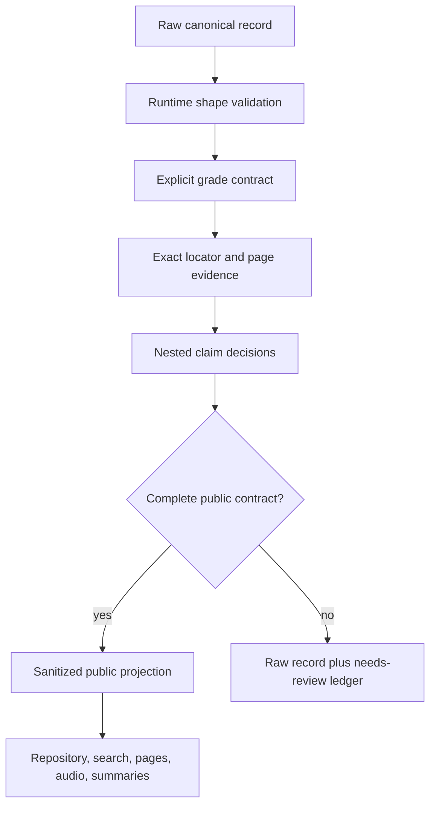
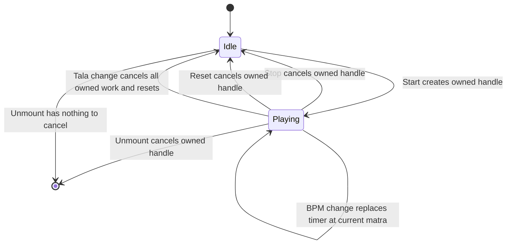
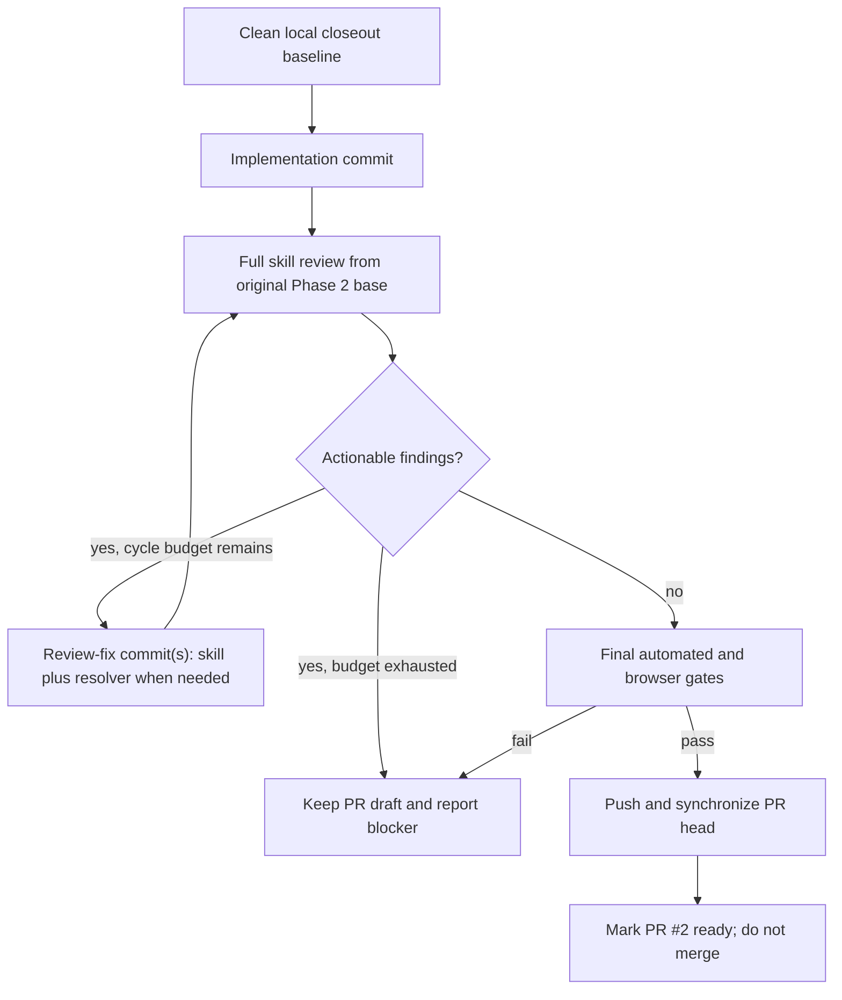

# fix: Close Phase 2 findings and make PR #2 merge-ready

## Summary

This plan defines a newly authorized, bounded closeout task for Phase 2. It resolves all 16 independently validated findings from review run `20260815-235819-p02r4`, rereviews the complete Phase 2 diff from `beba1479f473b3413b3f2de48a27c558e1937c6f`, runs the final technical and browser gates, pushes the existing PR branch, and marks PR #2 ready for review without merging it.

The task continues on `codex/forensic-p02-musical-core`. It preserves the clean pre-plan local head `97c0c138b2b90ac27516a3c8c3716361ac537981` and the four local commits not yet present on the remote branch; the saved plan is the only expected untracked artifact before execution begins. The task does not reset, squash, rebase, or relabel the earlier blocked review history.

---

## Problem Frame

Phase 2 has useful source-remediation work, but the latest complete acceptance review returned `Not ready to merge`. All nine required and conditional reviewers completed, all 17 validator tasks completed, 16 findings were validated, and one Deepchandi retrieval-variant finding was rejected. The previously green automated suite did not detect several publication, source-integrity, Web Audio lifecycle, and hydration defects.

The prior three review-fix cycles are exhausted. This plan treats the user's new-task authorization as a fresh closeout budget while preserving every prior run and commit. The final review still covers the full Phase 2 diff from the original base, so the new task cannot hide regressions behind the closeout start point.

Original PDFs remain absent. Extracted Markdown may establish readable text, but ambiguous glyphs, notation layout, corrupt bol cells, and Grade 11 claims from documents still marked `Review Required` cannot be promoted through inference or musicological memory.

---

## Requirements

### Publication and source integrity

- R1. Compose primary and nested claim eligibility into one fail-closed publication result used by filtering, projection, summaries, validation, search, and UI.
- R2. Require explicit non-empty canonical `gradeBands`; source metadata may validate a declared grade but must not invent one.
- R3. Treat malformed, unpaired, wrong-grade, or unsupported context claims as publication blockers, and keep Lawani non-public until its required school-system context has accepted evidence.
- R4. Parse source locators as a fully consumed grammar tied to one exact source filename and valid integer page clauses; reject confusables, invisible format characters, extra documents, and unconsumed page-like text.
- R5. Reconcile selected source identities and explicit unknown metadata across `src/data/sources.json`, `data/source-manifest.json`, `SOURCES.md`, and the forensic ledger.
- R6. Require a closed-world disposition for every public tala context and bol/theka field; quarantine the tala and every required dependent public reference when any row is missing, ambiguous, or needs-review.
- R7. Bound public acoustics, tala spelling, and Bilawal prose to the exact accepted source wording without diagram inference, general-knowledge completion, or unsupported classification.

### Runtime and data contracts

- R8. Make `TalaVisualizer` own playback cancellation by caller session so Start does not self-cancel and Stop, Reset, replacement, and unmount cancel only the active handle.
- R9. Make circular tala coordinates deterministic across server render and hydration.
- R10. Align TypeScript and runtime contracts by requiring `Quiz.lessonId` and `Tala.aliases_si` wherever publication and validation already require them.
- R11. Make catalog identity validation return structured issues for null or primitive entries instead of throwing.
- R12. Reject empty raga ascents/descents, invalid sample-phrase swaras, malformed tala bol fields, canonical-as-alias values, same-record duplicate aliases, and cross-record search-equivalent collisions.

### Audit and delivery

- R13. Preserve the Phase 1 ledger baseline as historical metadata while recording Phase 2 audit scope without claiming that a stored SHA is the current checkout.
- R14. Keep correction logs, field matrices, source catalogs, runtime data, and tests mutually consistent, with field-level source, page, quality, and disposition evidence.
- R15. Add regression coverage for every validated finding and preserve the rejected Deepchandi result as a retrieval-only, non-canonical mapping.
- R16. Complete a fresh mandatory `rajantha-skills-library:ce-code-review base:beba1479f473b3413b3f2de48a27c558e1937c6f plan:docs/plans/2026-08-16-001-fix-phase-2-pr-merge-ready-plan.md grouping:auto` loop with complete artifacts and no actionable findings or degraded P0/P1 validation.
- R17. Run the complete final verification and browser matrix on the final reviewed head, push the branch, update PR #2, and mark it ready only when local head, remote head, and PR head agree.

---

## Scope Boundaries

### In scope

- The 16 validated findings from `20260815-235819-p02r4` and regressions needed to make those fixes durable.
- The existing Phase 2 source, terminology, acoustics, raga, tala, audio, search, validation, evidence, and public-presentation surfaces affected by those findings.
- A durable repository summary of the closeout findings and final disposition.
- A fresh review-fix budget of at most three cycles for this explicitly authorized closeout task.
- Push and ready-state mutation for PR #2 after all acceptance gates pass.

### Deferred to follow-up work

- Original-PDF visual inspection, corrupt-font recovery, and SME adjudication for ambiguous notation or bol cells.
- Curriculum-map reconstruction or status-banner work, broad learning-path repair, and quarantine-ledger architecture beyond the closed-world Phase 2 field registry planned for later remediation phases.
- The pre-existing hostile `__proto__` and `constructor` search-key crash unless implementation in the same lookup path makes the bounded guard necessary to prevent a new regression; record it visibly if it remains deferred.
- Restoration of quarantined Lawani or other talas after accepted evidence establishes every required public field.

### Out of scope

- Grades 12–13, A/L, new ragas or talas, instruments, traditions, broad lesson/exam completion, deployment, hosted-service mutation, and production-readiness claims.
- Merging PR #2.
- Treating a test/build pass, reviewer timeout, missing artifact, or degraded validation as review acceptance.

---

## Key Technical Decisions

- KTD1. **Complete records at public boundaries:** Public tala pages and audio require a coherent record. When a required context or playable theka field is unsupported, quarantine the record rather than deleting only the disputed field and presenting an incomplete object.
- KTD2. **One publication decision:** A single decision object will carry record eligibility, declared grade scope, source evidence, nested-claim dispositions, withheld reasons, and the sanitized projection. Repository queries and validation will consume this same result.
- KTD3. **Declared grades are authoritative input:** Source grades are comparison evidence, not fallback data. Missing canonical grades fail with `missing-grade-scope`.
- KTD4. **Locator recognition is a parser, not substring mining:** The accepted locator shape must be fully consumed. Unicode format controls, confusable punctuation, multiple PDF-like tokens, decimal/negative/Roman page tokens, and trailing page-like text fail closed.
- KTD5. **Extracted text limits exact musical data:** Numeric tala structure may remain auditable in raw data, but exact normalized bol cells and synthesized playback remain non-public when the accepted extraction is ambiguous.
- KTD5a. **Closed-world field dispositions enforce evidence completeness:** Phase 2 will not add a semantic source-text comparison engine. A machine-readable registry will enumerate every required public context and bol/theka field for each tala with an explicit `verified` or `needs-review` disposition, exact evidence locator, quality, and forensic issue. Publication fails closed when a required row is missing or not verified.
- KTD6. **Caller-owned Web Audio sessions:** Each `playBol` call returns an isolated cancellation handle. React effects may clean up only handles created by that lifecycle owner; no previous cleanup may dereference a newly assigned handle.
- KTD7. **Deterministic visual serialization:** Circular coordinates are rounded or otherwise canonicalized before rendering so server and client emit identical style strings.
- KTD7a. **Playback configuration transitions are explicit:** Turning audio off cancels the active audio handle but keeps visual timing at the current matra; changing BPM cancels pending delayed strokes and replaces the interval while retaining the current matra; replacing the tala cancels audio and timing, returns to idle, and resets the display to matra 1.
- KTD8. **Immutable ledger semantics:** The ledger stores historical baseline and audited-through commits, not a self-referential “current checkout” assertion. Final reviewed head evidence belongs in the review artifacts and phase handoff.
- KTD9. **Fresh task, original review base:** The new closeout receives at most three review-fix cycles, but every rerun uses the original Phase 2 base so prior changes remain in scope.
- KTD10. **Student copy is separate from audit diagnostics:** Reason codes, filenames, evidence grades, and withheld-field details remain admin/audit data. Public empty and unavailable states use concise natural Sinhala, reveal only the useful status, and provide a safe recovery action.

---

## High-Level Technical Design

### Publication and evidence flow

### Tala playback ownership lifecycle

### Closeout and PR gate

---

## Implementation Units

### U1. Freeze the closeout baseline and encode the regressions

- **Goal:** Turn the 16 validated findings into durable repository traceability and failing characterization tests before behavior changes.
- **Requirements:** R14, R15.
- **Dependencies:** None.
- **Files:**
  - Create `docs/forensic-remediation/evidence/P02_CLOSEOUT_FINDINGS.md`.
  - Include `docs/plans/2026-08-16-001-fix-phase-2-pr-merge-ready-plan.md` in the closeout implementation commit so the controlling plan is inside the mandatory review scope.
  - Modify `src/test/publication-containment.test.ts`.
  - Modify `src/test/content-validator.test.ts`.
  - Modify `src/test/components.test.tsx`.
  - Modify `src/test/musical-core.test.ts`.
  - Modify `src/test/search-engine.test.ts` only if the bounded lookup path changes.
- **Approach:** Before editing, re-read the branch, HEAD, worktree inventory, original-base ancestry, local-only commits, `origin/main`, and PR #2 base/head/draft state. Permit only this inventoried plan as related untracked work and stop on unexplained drift. Summarize each validated finding, validator result, severity, affected contract, planned disposition, and regression owner. Preserve the rejected Deepchandi finding and prior exhausted-cycle history. Add executable characterization coverage before modifying the fragile policy, validator, and audio lifecycles. Every traceability row must name a test or deterministic repository comparison that reproduces the defect at the closeout start head and passes after the fix; narrative evidence alone does not satisfy R15. Stage the plan and every new evidence/test artifact before the closeout implementation commit.
- **Patterns to follow:** Existing mutation-based contract tests in `src/test/publication-containment.test.ts` and `src/test/content-validator.test.ts`; fake-timer and synthesized-plan tests in `src/test/musical-core.test.ts`.
- **Test scenarios:**
  - Start `TalaVisualizer` and observe that the newly returned playback handle is not cancelled during the state transition.
  - Exercise malformed and wrong-grade nested context, missing canonical grades, Unicode/confusable locators, null catalog entries, optional-type mismatches, alias duplicates, empty raga arrays, invalid phrase swaras, and unsupported content fixtures; each case must fail for the intended contract reason.
  - Render the circular tala on server and client inputs and assert identical coordinate strings.
  - Confirm the accepted Grade 10 Deepchand record still resolves from the Grade 11 retrieval spelling without publishing that spelling as a canonical alias.
- **Verification:** Every validated finding has a named executable regression or deterministic repository comparison that reproduces at the closeout start head and passes after its production fix.

### U2. Unify publication, grade, context, and locator contracts

- **Goal:** Replace split eligibility behavior with one fail-closed, source-aware publication decision and align public repository consumers with it.
- **Requirements:** R1, R2, R3, R4, R10, R15.
- **Dependencies:** U1.
- **Files:**
  - Modify `src/lib/data/publication-policy.ts`.
  - Modify `src/lib/data/repository.ts`.
  - Modify `src/types/content.ts`.
  - Modify `src/data/talas.json` to satisfy the required alias-array contract for every raw tala, including quarantined records.
  - Modify `src/test/publication-containment.test.ts`.
  - Modify `src/test/musical-core.test.ts`.
- **Approach:** Require explicit canonical grade arrays, validate them against source grades, and prevent parent/source inference from satisfying missing record fields. Fold optional nested claims into the same eligibility result. Reject any defined malformed or unpaired context value, require context-grade compatibility, and quarantine Lawani while its required Grade 11 context remains `Review Required`. Replace locator substring checks with a complete grammar tied to the catalogued original filename and valid page clauses. Make `Quiz.lessonId` and `Tala.aliases_si` required in both type and runtime contracts.
- **Patterns to follow:** `evaluateSourceReference`, `getRecordPublicationDecision`, and repository sanitization are the existing central boundary; extend this boundary rather than adding route-specific filters.
- **Test scenarios:**
  - Remove `gradeBands` from Bilawal and from a quiz question; both remain non-public with `missing-grade-scope` instead of inferred grades.
  - Provide context-only, reference-only, object-valued, empty-string, wrong-grade, and `Review Required` context claims; every malformed or unsupported case blocks the complete record.
  - Verify a supported context claim remains public and unchanged.
  - Feed locators with a second filename separated by whitespace, comma, slash, parentheses, or newline; each returns `mismatched-source-document`.
  - Feed U+200B/U+FF0E PDF confusables, decimal pages, suffixed integers, negative pages, Roman pages, and trailing page clauses; each fails closed.
  - Verify the accepted exact filename plus bounded integer page/list/range forms still pass.
  - Remove `lessonId` from a quiz or `aliases_si` from a tala; validation and publication reject the malformed record consistently.
  - Validate the actual raw tala catalog and confirm every record, including Roopak, carries an explicit aliases array.
  - Confirm every public repository getter, direct lookup, publication summary, and search result agrees with the unified decision.
- **Verification:** No public consumer can obtain a record that the unified decision rejects, and all rejection reasons are stable enough for tests and audit output.

### U3. Harden structural, musical, and identity validation

- **Goal:** Make runtime validation total over untrusted JSON and enforce the field invariants promised by Phase 2.
- **Requirements:** R10, R11, R12, R15.
- **Dependencies:** U1, U2.
- **Files:**
  - Modify `src/lib/validation/content-validator.ts`.
  - Modify `src/test/content-validator.test.ts`.
  - Modify `src/test/musical-core.test.ts`.
  - Modify `src/types/content.ts` if validation exposes a reusable runtime input type.
- **Approach:** Treat catalog inputs as unknown at the validation boundary, emit one structural issue for null or primitive records, and skip dependent checks safely. Validate required primitive types before semantic checks. Build normalized identity sets per record and across records for canonical names, aliases, glossary identities, and terminology variants. Require non-empty raga traversal arrays and validate every sample-phrase swara against the canonical notation grammar.
- **Patterns to follow:** The current structured `ValidationIssue` model and mutation tests; avoid exceptions as validation output.
- **Test scenarios:**
  - Pass null, string, number, and array elements in entity, glossary, and terminology catalogs; the validator returns scoped issues and never throws.
  - Set tala boolean fields to strings, indexes to non-integers, names/actions/bols to blank values, or bol entries to null; each produces a structural field issue without cascading exceptions.
  - Set `arohana_swaras` or `avarohana_swaras` to empty arrays and inject an invalid token into `samplePhrases`; each produces an entity-specific issue.
  - Add the canonical tala name as an alias, repeat one alias within the same record, or create a normalized collision across records; each is rejected.
  - Create search-equivalent glossary and terminology collisions across `term_si`, `term_en`, transliteration, and known variants; each is reported against the correct catalog.
  - Keep the canonical rest bol `-` valid while blank or whitespace bols remain invalid.
- **Verification:** All malformed mutations return deterministic issues, valid canonical data remains accepted, and no validation path throws.

### U4. Repair Web Audio ownership and deterministic tala rendering

- **Goal:** Preserve compound tabla subdivisions through Start and interleaved playback while eliminating the server/client style mismatch.
- **Requirements:** R8, R9, R15.
- **Dependencies:** U1.
- **Files:**
  - Modify `src/components/audio/TalaVisualizer.tsx`.
  - Modify `src/lib/audio/tabla.ts` only if the caller-session contract needs refinement.
  - Modify `src/test/components.test.tsx`.
  - Modify `src/test/musical-core.test.ts`.
- **Approach:** Separate interval lifecycle from playback-handle lifecycle. Start, beat replacement, Stop, Reset, and unmount operate on the handle owned by that component instance; cleanup captures the handle it owns instead of dereferencing a later mutable value. Audio-off cancels pending audio while visual timing continues, BPM change replaces the interval and pending stroke at the current matra, and tala replacement stops and resets to matra 1. Preserve per-call scheduling in `tablaSynth`. Canonicalize circular coordinates to fixed deterministic values before creating style strings.
- **Patterns to follow:** The caller-scoped cancellation function returned by `tablaSynth.playBol` and React Testing Library interaction tests.
- **Test scenarios:**
  - Click Start and assert no cancellation occurs before the first scheduled replacement or explicit stop.
  - Advance fake timers through a compound Khemta cell and observe all expected subdivisions after another component starts a simple stroke.
  - Click Stop and Reset and unmount separately; each cancels exactly the active handle once and does not cancel another component's handle.
  - Restart playback; the prior owned handle is cancelled and the new handle remains active.
  - Toggle audio off while active; pending audio is cancelled, visual timing and current matra continue, and future ticks remain silent until audio is re-enabled.
  - Change BPM while active; the old interval and delayed stroke are cancelled, the new interval begins at the selected tempo, and the current matra is retained.
  - Replace the tala while active; audio and interval are cancelled, playback becomes idle, and the displayed matra resets to 1.
  - Exercise rapid Start/Stop/Start and React StrictMode; no handle is double-cancelled and no interval or delayed stroke leaks.
  - At 360px, Start/Stop, Reset, audio, and view-mode controls expose accurate accessible names or pressed states, visible keyboard focus, keyboard operation, and at least 44-by-44-pixel targets.
  - Render representative circular talas through server and hydrated client paths; style strings match and no hydration warning is emitted.
- **Verification:** Component tests prove lifecycle ownership, compound-stroke timing remains intact, and browser console QA shows no hydration mismatch.

### U5. Reconcile source catalogs and forensic ledger authority

- **Goal:** Establish one honest source-metadata baseline and correct the ledger's phase/commit semantics.
- **Requirements:** R5, R13, R14, R15.
- **Dependencies:** U1, U2.
- **Files:**
  - Modify `src/data/sources.json`.
  - Modify `data/source-manifest.json`.
  - Modify `SOURCES.md`.
  - Modify `data/source-documents.json` only when the extracted corpus establishes a value already missing from the catalog.
  - Modify `data/forensic-ledger.json`.
  - Modify `src/lib/validation/content-validator.ts`.
  - Modify `src/test/content-validator.test.ts`.
  - Create `src/test/source-metadata-consistency.test.ts` if keeping the concern separate makes the contract clearer.
- **Approach:** Resolve each selected runtime source to `data/source-documents.json` through the existing exact `originalFilename` identity, including the specialized acoustics and raga-identification entries. Compare shared broad source IDs directly where applicable; do not require the catalogs to have identical ID universes or introduce a new crosswalk schema. For the selected Grade 10, Grade 11, acoustics, and raga-identification sources, compare every publisher, year, place, tier, licence, verification state, URL, and topic claim with the matched document and extracted metadata. Replace unsupported values with the standard unknown/unverified representation. Preserve the original ledger baseline in dedicated historical fields, record the latest audited phase/base without claiming live checkout identity, and test the selected-ID metadata contract across machine and human catalogs.
- **Patterns to follow:** The explicit unknown metadata already used in `src/data/sources.json` and the forensic ledger schema validator.
- **Test scenarios:**
  - For every selected source ID, compare identity and provenance fields across both JSON catalogs and the human source table; no catalog may reintroduce a known unsupported value.
  - Resolve `SRC-G10-NADA` and `SRC-G11-RAGA-ID` through exact original filenames and assert matched document identity, filename, and grade without inventing parallel manifest records.
  - Confirm Bhairav and other unsupported syllabus topics do not appear as established content for the selected source rows.
  - Mutate one selected source to a fabricated year, publisher, licence, status, URL, or topic and observe a cross-catalog issue.
  - Validate ledger baseline phase/base and latest-audit fields independently; stale “current checkout” wording is rejected.
  - Confirm ledger issue counts and stable IDs remain intact after the header migration.
- **Verification:** Selected source catalogs agree on known and unknown values, and the ledger accurately describes historical and current audit scopes without self-referential claims.

### U6. Bound public musical and acoustics content to accepted evidence

- **Goal:** Remove unsupported learner-facing claims and quarantine records whose required exact fields cannot be established from accepted extracted text.
- **Requirements:** R3, R6, R7, R14, R15.
- **Dependencies:** U2, U3, U5.
- **Files:**
  - Modify `src/data/talas.json`.
  - Create `data/musical-core-field-dispositions.json`.
  - Modify `src/data/ragas.json`.
  - Modify `src/data/lessons.json`.
  - Modify `src/data/glossary.json`.
  - Modify `data/terminology-si.json`.
  - Modify `src/data/quizzes.json` only where a question repeats a corrected claim.
  - Modify `src/lib/data/publication-policy.ts`.
  - Modify `src/lib/data/repository.ts` for cross-entity dependency closure.
  - Modify `src/lib/validation/content-validator.ts` for disposition-registry completeness.
  - Modify `src/lib/search/search-engine.ts` only for evidence-bounded spelling retrieval.
  - Modify `src/app/search/page.tsx` when a hard-coded discovery sample names a quarantined tala.
  - Modify `src/app/talas/page.tsx`.
  - Modify `src/app/talas/[id]/page.tsx` if withheld disposition needs an honest unavailable state.
  - Modify `src/components/audio/EarTrainingModule.tsx` when a hard-coded exercise depends on a quarantined tala or disputed bol sequence.
  - Modify `src/test/musical-core.test.ts`.
  - Modify `src/test/publication-containment.test.ts`.
  - Modify `src/test/content-validator.test.ts`.
  - Modify `src/test/search-engine.test.ts`.
  - Modify `src/test/components.test.tsx`.
- **Approach:** Audit each affected content field against the exact accepted Markdown page. Use the exact Grade 10 spellings for Teental and Jhaptal. Keep Grade 11 or common spellings retrieval-only while their source remains `Review Required`. Remove Bilawal's unsupported “basic thaat raga” classification. Rewrite acoustics text to vibration count per second, a non-directional factor list, and general voice/instrument waveform recognition; remove unsupported Hz/Hertz, directional diagram inferences, and violin-versus-flute claims. Populate the closed-world disposition registry for every tala's required context and bol/theka fields. The unified publication decision rejects a tala if any required row is absent or not verified. Extend dependency closure so a public lesson, quiz, path step, search sample, fallback, guided/listen activity, or hard-coded exercise cannot require a quarantined raga or tala. Use neutral tala-directory wording and natural-Sinhala empty/unavailable states.
- **Patterns to follow:** Raw-record preservation plus centralized quarantine from Phase 1; retrieval-only mappings in `src/lib/search/search-engine.ts`; field-level disposition rows in `docs/forensic-remediation/evidence/P02_MUSICAL_CORE_FIELD_MATRIX.md`.
- **Test scenarios:**
  - Query exact Grade 10 Teental/Jhaptal spellings and allowed retrieval variants; both resolve the intended canonical record without promoting a `Review Required` alias.
  - Search and render public content for the unsupported Bilawal phrase, Hz/Hertz additions, directional formulas, flute example, and generic Lawani classification; each is absent.
  - Verify readable source-backed acoustics statements remain present and retain exact source/page references.
  - For every tala, assert all required context and bol/theka field rows exist. Delete one disposition row or change it to `needs-review`; the record becomes non-public and non-playable.
  - Confirm raw quarantined tala data and ledger entries remain available to audit tooling but are absent from list pages, direct public routes, search, audio, and summaries.
  - Inventory reverse references to every quarantined tala and assert dependent lessons, quizzes, path steps, search samples, fallback targets, guided/listen activities, and audio exercises are also contained or remediated.
  - Confirm Dadra, Lawani, and every other affected tala receives an explicit public or needs-review disposition based on its own readable fields, not collection completeness targets.
  - Render an empty verified tala catalog and a zero-result search separately; each shows distinct natural-Sinhala guidance and a safe clear-search or return action rather than a blank grid.
  - Render an unavailable direct route and confirm no internal reason code, filename, evidence grade, or audit jargon leaks into student copy.
- **Verification:** Every remaining public claim is traceable to accepted text; ambiguous or required-context records are consistently quarantined across all public surfaces.

### U7. Synchronize evidence documentation and run end-to-end browser QA

- **Goal:** Make the human evidence trail match final runtime behavior and prove the repaired public flows at desktop and mobile sizes.
- **Requirements:** R13, R14, R15, R17.
- **Dependencies:** U2, U3, U4, U5, U6.
- **Files:**
  - Modify `docs/FORENSIC_CORRECTION_LOG.md`.
  - Modify `docs/FORENSIC_PUBLICATION_BASELINE.md` if the public-count baseline changes.
  - Modify `docs/forensic-remediation/evidence/P02_MUSICAL_CORE_FIELD_MATRIX.md`.
  - Modify `data/content-coverage.json` if computed public counts change.
  - Modify `docs/forensic-remediation/evidence/P02_CLOSEOUT_FINDINGS.md`.
  - Create `docs/forensic-remediation/evidence/P02_BROWSER_QA.md`.
  - Modify affected component and route tests from U1-U6 if browser QA exposes a regression.
- **Approach:** Update before/after claims, source IDs, exact filenames, PDF pages, evidence quality, and final disposition after production files stabilize. Use stable entity/field/test anchors and refresh required line references after each accepted review-fix commit. Record original-PDF/SME boundaries rather than closing them. Exercise representative public and quarantined routes at 1440x900 and 360x568, including audio interaction and console inspection, and preserve the procedure and pre-review results in the browser-QA artifact. The final post-review rerun is written to an immutable per-run acceptance artifact keyed by the reviewed head, not back into the reviewed repository.
- **Patterns to follow:** Append-only correction history in `docs/FORENSIC_CORRECTION_LOG.md` and the bounded language already used in the Phase 2 field matrix.
- **Test scenarios:**
  - Compare the field matrix, correction log, source catalogs, forensic ledger, content-coverage counts, and repository publication summary; every disposition and count agrees.
  - Visit public tala, raga, acoustics, search, and practice surfaces; no quarantined entity or unsupported phrase is discoverable.
  - Visit quarantined direct routes; each returns the established safe unavailable/not-found state.
  - Start and stop representative simple and compound tala playback; no immediate cancellation, cross-component cancellation, autoplay, or console error occurs.
  - Inspect desktop and 360px views for hydration warnings, overflow, inaccessible controls, and misleading generic framing.
- **Verification:** Documentation drift checks pass, exact evidence boundaries are visible, and browser QA records zero unexpected console/page errors or horizontal overflow.

### U8. Complete the fresh review loop and ready PR #2

- **Goal:** Produce auditable acceptance evidence, synchronize the remote branch, and change PR #2 from draft to ready without merging it.
- **Requirements:** R16, R17.
- **Dependencies:** U7.
- **Files:**
  - Modify only files required by validated review findings during each bounded review-fix cycle.
- **Approach:** Create a local closeout implementation commit on the clean branch, then invoke the full `ce-code-review` skill in default mode against the original Phase 2 base, passing this plan explicitly and using `grouping:auto`. Require the six always-on reviewers plus security, API-contract, and adversarial specialists because the diff affects public eligibility, hostile input parsing, Web Audio, and data contracts. Independently validate every surviving finding. Each cycle may contain one isolated skill-created review-fix commit plus one tested downstream-resolver review-fix commit when actionable findings were not applied by the skill; record both SHAs and rerun the full review, for no more than three cycles in this new task. After a `Ready to merge` verdict, rerun every local gate and browser scenario on the reviewed head. A successful local gate authorizes a normal push. After push, verify remote-head equality, mergeability, and required hosted checks; update the PR description with final review evidence and mark PR #2 ready only when that remote gate passes. Final accepting run IDs, validator metrics, and reviewed-head evidence live in immutable review artifacts, the PR description, and the phase handoff rather than a post-review repository edit.
- **Patterns to follow:** `AGENTS.md` Sections 9-11 and `docs/forensic-remediation/SKILL_MULTI_AGENT_REVIEW.md`.
- **Test scenarios:**
  - Compare the skill's changed-file inventory with the complete Git diff from the original base; no tracked or staged phase file is omitted.
  - Confirm every required reviewer artifact is valid and every surviving finding has an independent validator result.
  - Confirm acceptance only when status is complete, verdict is `Ready to merge`, actionable findings are zero, degraded P0/P1 validation is zero, and explicit Prompt 2 requirements are met.
  - Rerun targeted tests, the complete test suite, strict type check, lint, production build, forensic JSON/ledger checks, Git whitespace checks, and the browser matrix on the exact reviewed head; the immutable browser artifact records that SHA and its checksum is carried into the PR description and handoff.
  - After push, confirm local head, remote branch head, and PR #2 head are identical and the PR is open and ready rather than draft or merged.
- **Stop conditions:** Keep the branch unpushed and PR #2 draft if any pre-push test, source, browser, reviewer, validator, artifact, or explicit-plan gate is incomplete; if actionable findings remain after three fresh cycles; if `main` or the PR base/head changed unexpectedly; or if a normal non-force push or authentication cannot be completed safely. If a hosted check, mergeability state, or remote-head verification fails after push, preserve the pushed branch, keep PR #2 draft, and report the blocker. Any code, data, test, or documentation mutation after final review invalidates that review and requires another in-budget full rerun.
- **Verification:** The worktree is clean, final gates pass on the reviewed head, complete review artifacts exist, the remote branch is synchronized, and PR #2 is ready for human review.

---

## Validated-Finding Traceability

| Finding | Validated defect | Requirements | Units |
|---|---|---|---|
| 01 | Start immediately cancels the new playback handle | R8, R15 | U1, U4 |
| 02 | Context policy diverges and accepts malformed/wrong-grade claims | R1, R3, R15 | U1, U2, U6 |
| 03 | Null catalog entries crash identity validation | R11, R15 | U1, U3 |
| 04 | Source manifest and bibliography retain unsupported metadata/topics | R5, R14, R15 | U1, U5 |
| 05 | Ledger header identifies the wrong phase/current checkout | R13, R14, R15 | U1, U5, U7 |
| 06 | Unicode and malformed locator forms bypass source identity | R4, R15 | U1, U2 |
| 07 | Missing canonical grades are inferred and remain public | R2, R15 | U1, U2 |
| 08 | Optional `Quiz.lessonId` contradicts runtime parent policy | R10, R15 | U1, U2 |
| 09 | Optional and duplicate tala aliases pass inconsistently | R10, R12, R15 | U1, U2, U3 |
| 11 | Circular coordinates hydrate differently | R9, R15 | U1, U4 |
| 12 | Tala directory applies generic North Indian framing to Lawani | R3, R7, R15 | U1, U6, U7 |
| 13 | Public normalized tala bols exceed readable evidence | R6, R14, R15 | U1, U6 |
| 14 | Acoustics prose adds unsupported claims | R7, R14, R15 | U1, U6 |
| 15 | Teental and Jhaptal spellings drift from accepted Grade 10 text | R7, R14, R15 | U1, U6 |
| 16 | Bilawal adds an unsupported classification | R7, R14, R15 | U1, U6 |
| 17 | Raga arrays/phrases and aliases have validation gaps | R12, R15 | U1, U3 |

Finding 10 is intentionally absent from the actionable list: its validator rejected the claim that the Grade 11 Deepchandi spelling was lost. R15 preserves the tested retrieval-only behavior without promoting a `Review Required` spelling to canonical evidence.

---

## Acceptance Examples

- AE1. Given a canonical entity without `gradeBands`, when publication eligibility is evaluated, then it is non-public with `missing-grade-scope` and no source-derived fallback.
- AE2. Given Lawani with a required context citation from a `Review Required` document, when public collections are built, then the raw record remains auditable and the public record is unavailable rather than context-stripped.
- AE3. Given a locator containing an invisible character, confusable PDF dot, second filename, malformed number, or unconsumed page clause, when source evidence is evaluated, then the locator fails closed.
- AE4. Given a tala with an ambiguous exact bol cell, when repository, search, route, summary, and audio consumers run, then none can publish or play that tala.
- AE5. Given `TalaVisualizer` is idle, when Start is clicked, then its handle remains active; when Stop, Reset, replacement, or unmount occurs, only its current owned handle is cancelled.
- AE6. Given server render and client hydration of the same circular tala, when coordinate styles are compared, then they are byte-identical and React logs no hydration warning.
- AE7. Given null or malformed catalog data, when validators run, then they return structured issues without throwing and without treating dependent checks as valid.
- AE8. Given the complete Phase 2 diff passes final review and verification, when the branch is pushed, then PR #2 points to that exact head and becomes ready for review without being merged.

---

## System-Wide Impact

- **Public data boundary:** Repository list/detail methods, search, route rendering, counts, and audio receive fewer but more trustworthy records. Public-count changes are expected when exact theka or required context evidence is insufficient.
- **Raw audit data:** Quarantine never deletes raw entities. Admin/forensic tools retain source and disposition details without treating them as student-facing publication.
- **Type and validator boundary:** Making quiz parents and tala alias arrays required may expose additional raw records that need explicit remediation; these are contract corrections, not optional cleanup.
- **Audio lifecycle:** Cancellation becomes instance-scoped. No global timer cancellation is introduced, and explicit user activation and client-only synthesis remain unchanged.
- **Documentation authority:** Source catalogs and forensic documents become consistency-checked peers of runtime data instead of unchecked narrative copies.

---

## Risks and Mitigations

| Risk | Impact | Mitigation |
|---|---|---|
| Quarantining ambiguous talas reduces public coverage | Students see fewer tala records | Prefer honest absence over invented certainty; retain raw records and exact restoration blockers. |
| One unified publication decision changes many consumers | A bypass or over-containment could spread broadly | Characterize every getter/route/search/summary first and assert parity across consumers. |
| Strict locator grammar rejects legitimate historical phrasing | Valid evidence could be held for review | Enumerate current accepted locator forms before tightening and keep rejection reasons observable. |
| Type corrections reveal legacy malformed fixtures | Build or validation may fail beyond the first target | Remediate only Phase 2-dependent records and quarantine unrelated malformed content under existing policy. |
| React audio cleanup remains timing-sensitive | Compound strokes may disappear or leak | Test Start, replacement, Stop, Reset, unmount, fake-timer callbacks, and co-mounted callers separately. |
| Evidence docs gain stale line anchors after review fixes | Audit claims become misleading | Refresh required anchors after each accepted review-fix commit and verify them before rereview. |
| New closeout review still finds actionable issues after three cycles | PR cannot be readied | Preserve commits/artifacts, keep PR draft, and report the exact blocker without pushing an unaccepted head. |

---

## Verification Strategy

The closeout uses characterization-first coverage for publication, validation, and Web Audio lifecycles. Each implementation unit runs its focused tests before being considered complete. The final reviewed head must pass the repository's complete Vitest suite, strict TypeScript check, lint, production build, forensic JSON/ledger validation, cross-catalog consistency checks, and Git whitespace validation.

Browser QA covers 1440x900 and 360x568 viewports. It exercises public and quarantined raga/tala routes, acoustics, search, practice, Lawani disposition, Deepchand retrieval, and simple/compound tabla playback. Acceptance requires no unexpected console or page errors, hydration warnings, autoplay, cross-component cancellation, or horizontal overflow.

Review acceptance is separate from local verification. Green scripts or browser checks cannot substitute for complete `ce-code-review` scope, reviewer artifacts, independent validation, zero actionable findings, and a `Ready to merge` verdict.

| Gate | Canonical runner or evidence | Pass condition |
|---|---|---|
| Focused regressions | Affected Vitest files named in U1-U7 | Every finding-specific negative and positive scenario passes. |
| Complete tests | Package script `test` | All suites pass on the final reviewed head. |
| Static typing | Package script `type-check` | Zero TypeScript errors. |
| Lint | Package script `lint` | Zero warnings or errors. |
| Production build | Package script `build` | Static production build completes for every expected route. |
| Forensic contracts | Ledger/inventory tests in `src/test/publication-containment.test.ts`, `src/test/content-validator.test.ts`, and the selected-source consistency test | JSON parses, schema/identity/count/cross-catalog assertions pass, and no public-policy drift remains. |
| Diff integrity | Base-to-final-head whitespace validation | No whitespace errors; expected line-ending notices are classified separately. |
| Browser QA baseline | Procedure and pre-review route/viewport/console results in `docs/forensic-remediation/evidence/P02_BROWSER_QA.md` | Required desktop/mobile scenarios are reproducible before acceptance review. |
| Final browser QA | Immutable per-run acceptance artifact keyed by the exact reviewed head | Required routes and audio interactions pass with no unexpected console/page/hydration/overflow defect, and the artifact SHA matches the pushed PR head. |
| Skill review | Immutable `ce-code-review` run artifacts | Complete scope and reviewer coverage, successful validators, zero actionable findings, no degraded P0/P1, and `Ready to merge`. |
| Remote PR | PR #2 state and head evidence in the PR description and final handoff | Local/remote/PR heads agree, hosted checks and mergeability pass, PR is open and ready, and no merge occurred. |

---

## Documentation and Handoff

The final paste-ready handoff must include the original Phase 2 base, closeout start head, implementation and review-fix commits, final reviewed head, changed-file inventory, clean worktree state, review run IDs and artifact locations, reviewer selection reasons/outcomes, validator metrics, findings/fixes/rejections, residual risks, testing gaps, all final verification and browser results, source/correction artifact paths, and PR #2's URL, base/head branches, synchronized head SHA, and ready state.

The handoff must keep these needs-review boundaries visible: absent original PDFs, ambiguous/corrupt exact bol cells, Grade 11 context and spelling claims from `Review Required` documents, and any quarantined record awaiting manual/SME evidence.

---

## Sources and Research

- `docs/forensic-remediation/prompts/02-canonical-musical-core.md` defines the Phase 2 source, content, audio, review, and non-goal contracts.
- `docs/forensic-remediation/PHASED_PLAN.md` defines the programme gates and later-phase boundaries.
- `AGENTS.md` Sections 8-11 define evidence containment, fresh review acceptance, PR readiness, and handoff rules.
- Review run `20260815-235819-p02r4` provides the complete nine-reviewer, seventeen-validator acceptance baseline used by the finding traceability table.
- `oriental_music_markdown/by-source/grade_10_musical_fundamentals.md`, `oriental_music_markdown/by-source/grade_10_nadaya.md`, and `oriental_music_markdown/by-source/grade_11_raga_identification.md` are the accepted extracted-text evidence for the affected Phase 2 claims.
- `data/source-documents.json` and `data/source-page-quality.json` define source triage and page-quality limits. No external research is load-bearing because the unresolved facts require repository-supplied official evidence or original-PDF/manual review, not general web knowledge.
