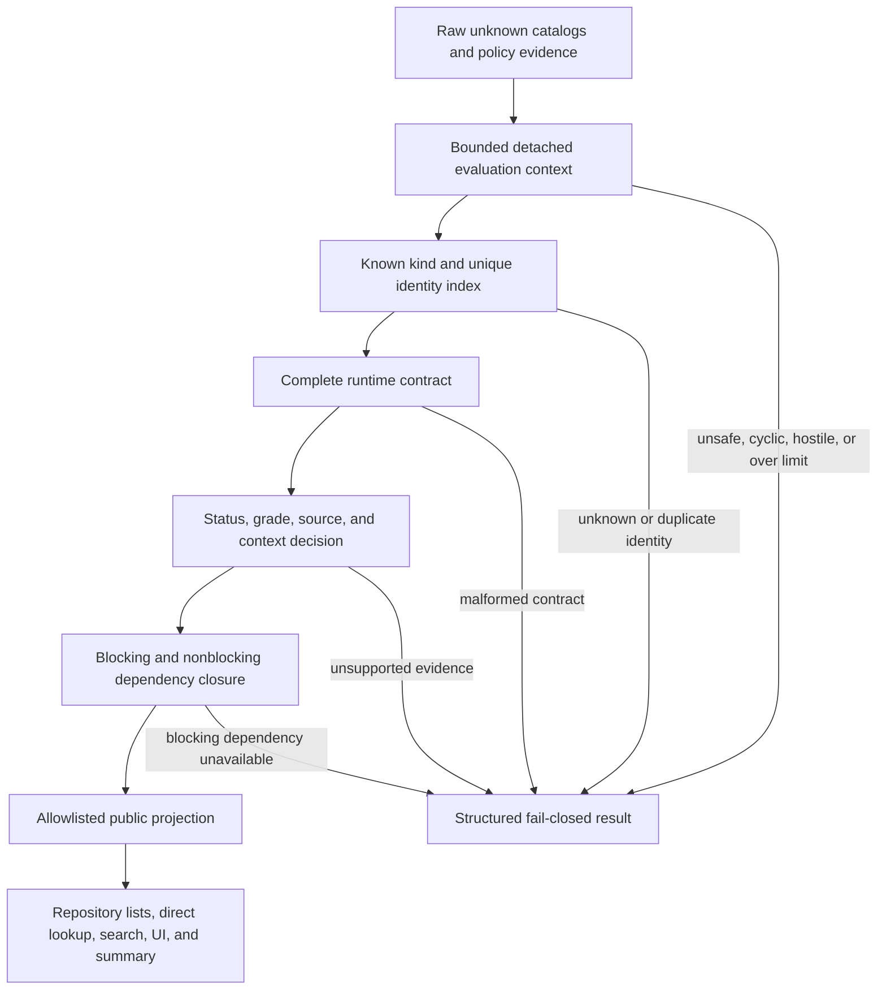
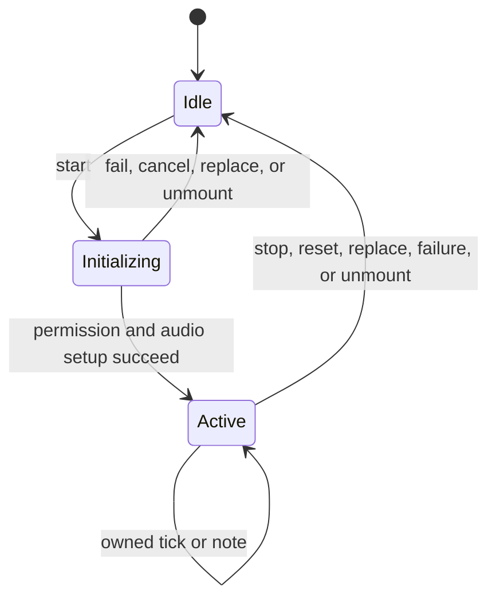

# Phase 2 Acceptance Hardening and PR #2 Readiness

## Summary

Close all 20 findings validated by Phase 2 review cycle 3, plus the authorized microphone-cleanup and project-scope corrections. Start from clean local HEAD `4c8ab9755d20d4d23cc8081fe831f448b15f3a2e` on `codex/forensic-p02-musical-core`, preserve the original Phase 2 base `beba1479f473b3413b3f2de48a27c558e1937c6f`, and keep PR #2 draft and unpushed until every acceptance gate passes.

---

## Problem Frame

The previous closeout produced a locally green implementation, but its third mandatory review independently validated 20 remaining findings. Records are sometimes reread after snapshot validation, identity/evidence/source/summary decisions use separate projections or caches, boundary coverage is incomplete, and audio ownership does not consistently invalidate callbacks, timers, and completed handles.

This is a bounded continuation of Phase 2, not a new curriculum phase.

---

## Requirements

### Publication and evidence

- R1. One bounded immutable snapshot must govern identity, contracts, evidence, dependencies, projection, repository output, and summaries.
- R2. Unknown kinds, duplicate IDs, hostile containers, stale catalog state, malformed metadata, and graph failures must fail closed without throwing.
- R3. A Lesson's `published` flag must agree with its review status; CMS operations must never infer publication.
- R4. Public source projections must expose only the existing unknown/unverified provenance representation.
- R5. Summary results must reflect every current content and evidence input without stale cache reuse.
- R6. All eight Talas remain whole-entity quarantined, and blocking versus nonblocking dependencies follow one declarative matrix.

### UI and audio

- R7. Public questions must exclude forensic audio/notation fields, and empty quizzes must render a safe Sinhala unavailable state.
- R8. Invalid runtime search queries return no results without throwing; legitimate empty and whitespace queries retain featured behavior.
- R9. Rhythm and Tabla callbacks, timers, and handles must remain session-owned and failure-atomic.
- R10. Microphone initialization failure, replacement, pending permission, stop, and unmount must release all acquired resources and suppress stale callbacks.

### Acceptance and delivery

- R11. Project guidance must consistently state Grades 6-11 as the current public boundary without inventing a source count.
- R12. Historical blocked reviews remain historical; only the new acceptance-only review can authorize a push and PR readiness.
- R13. No new musical fact, inferred metadata, A/L content, Grade 12-13 publication, merge, deployment, rebase, squash, or force-push enters this task.

---

## Key Technical Decisions

- KTD1. **Per-operation evaluation context:** Capture content catalogs and policy evidence once per public operation. Build kind and identity indexes from those snapshots, then never read the original records again.
- KTD2. **Remove summary memoization:** Recompute the small publication summary from the current evaluation context instead of maintaining a fragile cross-catalog cache.
- KTD3. **Checked batch boundary:** Add a structured publication-batch evaluation used internally by repositories and validators. Preserve the existing decision-list API as a fail-closed wrapper returning no decisions for malformed outer input.
- KTD4. **Stable failure reasons:** Distinguish malformed containers, duplicate IDs, unknown kinds, malformed records, source failures, and dependency failures. Incomplete decision batches count as needs-review rather than reducing raw counts.
- KTD5. **Explicit public question model:** Define renderable question variants from shared public fields plus variant-specific answer fields. Forensic-only fields remain confined to raw audit types.
- KTD6. **Generation-owned audio:** Rhythm, Tabla, and Pitch callbacks may update state only while their owning generation remains current.
- KTD7. **Review budget:** Permit up to three finding/fix cycles, followed by one mandatory full acceptance-only review. Findings in that final review block delivery and do not authorize another fix cycle.

---

## High-Level Technical Design

---

## Finding Traceability

| Findings | Implementation unit |
|---|---|
| C3-01, C3-04-C3-08 | U1 |
| C3-02, C3-03, C3-09, C3-10, C3-12 | U2 |
| C3-11 | U3 |
| C3-14, C3-15 | U4 |
| C3-16 | U5 |
| C3-17-C3-20 | U6 |
| Pre-existing microphone cleanup P1 | U7 |
| C3-13 and project-scope contradiction | U8 |

The earlier rejected Deepchandi finding remains rejected and historical.

---

## Implementation Units

### U1. Unify record snapshots, identity, decisions, and projections

- **Goal:** Eliminate publication TOCTOU, stale kind indexes, duplicate-ID bypasses, mismatched projections, and hostile batch failures.
- **Files:** `src/lib/validation/content-contracts.ts`, `src/lib/data/publication-policy.ts`, `src/lib/data/repository.ts`, `src/test/content-contracts.test.ts`, `src/test/publication-containment.test.ts`.
- **Approach:** Capture dense collections and records through the existing iterative bounds; build kind and duplicate-ID indexes from captured records per evaluation context; validate and project from the same snapshot; enforce Lesson status/flag consistency; remove summary memoization.
- **Test scenarios:** Contradictory publication metadata; malformed, sparse, revoked, throwing, and oversized batches; stateful and transparent Proxies; same-length catalog mutation; mismatched kinds; repository/list/summary parity.
- **Verification:** Every public decision contains a projection derived from its own validated snapshot and no exported boundary throws for unknown input.

### U2. Consolidate source, evidence, and forensic validation

- **Goal:** Make provenance projection and selected-source/disposition validation deterministic and unknown-safe.
- **Files:** `src/lib/validation/content-validator.ts`, `src/lib/validation/content-contracts.ts`, `src/lib/data/publication-policy.ts`, `src/lib/data/repository.ts`, `src/test/source-metadata-consistency.test.ts`, `src/test/publication-containment.test.ts`.
- **Approach:** Share the sanitized source projection; require exactly one extracted-document match; snapshot selected-source and field-disposition records; validate every nested Tala bol before access.
- **Test scenarios:** Evidence-quality mutation; source projection parity; zero/duplicate documents; hostile source/disposition records; malformed nested bol rows.
- **Verification:** Validators return deterministic issues and preserve source containment.

### U3. Declare and prove the complete dependency matrix

- **Goal:** Make dependency handling exhaustive across validation, policy, projection, repository, search, and summaries.
- **Files:** `src/lib/data/publication-policy.ts`, `src/lib/validation/content-contracts.ts`, `src/lib/data/repository.ts`, `src/test/publication-containment.test.ts`, `src/test/content-contracts.test.ts`.
- **Approach:** Use one declarative matrix for blocking prerequisites, path steps/mastery quizzes, quiz parents, and playable Tala/Raga references, plus nonblocking quiz/next links. Preserve whole-parent Tala quarantine.
- **Test scenarios:** Every dependency key across all public boundaries; exact and over-limit graph depth/nodes; wide/deep graphs; direct/mutual cycles; sparse arrays; shared DAGs; optional-link stripping.
- **Verification:** Every recognized dependency has one tested disposition and every public surface agrees.

### U4. Separate forensic questions from renderable quizzes

- **Goal:** Prevent forensic payload leakage and make `QuizRunner` safe for empty or malformed input.
- **Files:** `src/types/content.ts`, `src/lib/validation/content-contracts.ts`, `src/components/quiz/QuizRunner.tsx`, `src/test/content-contracts.test.ts`, `src/test/components.test.tsx`.
- **Approach:** Define explicit renderable/scorable question variants; retain forensic fields only in raw types; strip unexpected fields in projections; render a supportive Sinhala unavailable state for no valid question.
- **Test scenarios:** Compile-time public type rejection; runtime stripping; empty/sparse/malformed questions; all supported quiz formats.
- **Verification:** Public question types and projections contain only supported renderer fields.

### U5. Harden repository and search query boundaries

- **Goal:** Make malformed runtime queries safe while preserving intended empty-query behavior.
- **Files:** `src/lib/data/repository.ts`, `src/lib/search/search-engine.ts`, `src/test/search-engine.test.ts`, `src/test/publication-containment.test.ts`.
- **Approach:** Runtime-narrow every exported search query; retain featured behavior for omitted/empty/whitespace strings; return no results for non-string or normalized-empty hostile queries.
- **Test scenarios:** Numbers, objects, arrays, symbols, accessors, throwing Proxies, bidi/zero-width controls, and valid Sinhala/English/transliterated searches.
- **Verification:** Every search boundary classifies queries identically and never throws.

### U6. Make Rhythm and Tabla playback failure-atomic

- **Goal:** Prevent session resets, retained handles, stale UI callbacks, and surviving delayed timers.
- **Files:** `src/components/audio/RhythmTapGame.tsx`, `src/components/audio/TalaVisualizer.tsx`, `src/lib/audio/tabla.ts`, `src/test/components.test.tsx`, `src/test/synth.test.ts`.
- **Approach:** Keep the latest completion callback in a ref; remove settled handles; guard observers with mounted/session/ownership state; cancel every remaining timer after immediate or delayed callback failure.
- **Test scenarios:** Callback-identity rerender, handle settlement, reset/replacement/unmount, stale callbacks, delayed failures, and co-mounted isolation.
- **Verification:** Sessions own only active work and every completion/failure path is idempotent.

### U7. Close PitchDetector resource and privacy failures

- **Goal:** Guarantee microphone and AudioContext cleanup during every partial-start, replacement, stop, and unmount path.
- **Files:** `src/lib/audio/pitch.ts`, `src/components/audio/PitchDetectorView.tsx`, `src/test/pitch.test.ts`.
- **Approach:** Give each start a generation token; stop late streams; clean all partial resources on setup/detection/callback failure; treat frame ID zero as valid; make cleanup idempotent and preserve the local-only Promise API.
- **Test scenarios:** Permission/API failure, every post-permission setup failure, pending stop/unmount, repeated starts, callback failure, hostile cleanup, and no upload/network path.
- **Verification:** No failed or stale start can retain microphone, context, frame, or callback ownership.

### U8. Reconcile rules and acceptance evidence

- **Goal:** Make project guidance and the Phase 2 audit trail accurate on the final candidate.
- **Files:** `AGENTS.md`, this plan, `docs/FORENSIC_CORRECTION_LOG.md`, `docs/forensic-remediation/evidence/P02_CLOSEOUT_FINDINGS.md`, `docs/forensic-remediation/evidence/P02_MUSICAL_CORE_FIELD_MATRIX.md`, `data/forensic-ledger.json`, `src/test/review-closeout.test.ts`.
- **Approach:** State the Grades 6-11 public boundary; remove public A/L and fixed source-count wording; preserve raw quarantined records; clarify CMS stages; append findings without rewriting history; refresh final anchors only after code stabilizes.
- **Test scenarios:** Guidance consistency, anchor resolution, and ledger traceability.
- **Verification:** Each scoped finding resolves from review evidence to test, fix, final anchor, and disposition.

---

## Verification and Review Gate

1. Confirm branch, worktree, original base, and remote PR head before implementation and again before any push.
2. Create one local implementation commit after U1-U8 and full local verification.
3. Invoke `rajantha-skills-library:ce-code-review base:beba1479f473b3413b3f2de48a27c558e1937c6f plan:docs/plans/2026-08-16-003-fix-phase-2-acceptance-hardening-plan.md grouping:auto`. No specific model, provider, or named reasoning level is required; use models supported by the active agent environment and the review skill, and record the actual model/provider coverage for all eleven required reviewers and every validator.
4. Permit at most three finding/fix cycles, each with one tested `fix(review): ...` commit, then one full acceptance-only review. Findings in the acceptance review block delivery.
5. Acceptance requires `status: complete`, full original-base scope, complete artifacts, `Ready to merge`, zero actionable findings, and no degraded P0/P1 or unmet requirement.
6. On the immutable accepted SHA, run `npm run test`, `npm run type-check`, `npm run lint`, `npm run build`, `git diff --check`, JSON/forensic/source/publication consistency, and `rajantha-skills-library:browser-qa` at 1440x900 and 360x568.
7. Only then push normally, update existing PR #2, wait for hosted checks on the reviewed SHA, and mark it ready. Never merge or deploy.

---

## Scope Boundaries

### Included

- The 20 validated cycle-3 findings.
- PitchDetector post-permission cleanup and pending-start ownership.
- Project-rule synchronization to the Grades 6-11 public boundary.
- Tests and evidence required to accept these changes.

### Deferred to Follow-Up Work

- Semantic resolution of forensic-ledger evidence targets.
- Legacy validator debt not naturally closed by the shared collection boundary.
- Original-PDF, diagram, notation, corrupt-glyph, and SME review.
- Grades 12-13/A/L publication, curriculum reconstruction, Phase 3 content, redesign, deployment, merge, and unrelated cleanup.

### Preserved invariants

- All eight Talas remain whole-entity quarantined.
- Unsupported data remains retained for audit rather than deleted.
- No invented musical facts, publishers, dates, licences, reviewers, or publication states.
- No reset, rebase, squash, force-push, or history rewriting.
